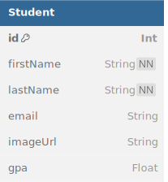

# Student Roster

## Getting Started

1. Click "Use This Template" and "Create a new repository."
2. Clone down your repo and run `npm install`.
3. Create a `.env` file according to the provided `example.env`.
4. Apply the initial Prisma migration and generate the client.\
   `npx prisma migrate reset`
5. Start developing!\
   `npm run dev`

## Architecture

### Backend

The backend consists of an [Express](https://expressjs.com/) server with a SQLite database and [Prisma](https://www.prisma.io/) as the ORM. The entrypoint is `src/server/index.js`.

API routes can be found in `src/server/api/`.

<!-- Authentication is handled with [JWT](https://github.com/auth0/node-jsonwebtoken). User passwords are hashed with [bcrypt](https://github.com/kelektiv/node.bcrypt.js). -->

To seed database, do the following:
   - create .env file in root directory using the code from example.env from the template.
   - in your terminal run the following commands:
      - npm i
      - npx prisma migrate dev
   - Use npx prisma studio to view database
   


<details>

<summary>Expand to see DBML</summary>

```dbml
Table Student {
  id        Int      [pk]
  firstName String   [not null]
  lastName  String   [not null]
  email     String   [unique]
  imageUrl  String   [default("blank_image")]
  gpa       Float    
}
```

</details>

### Frontend

The frontend is a [React](https://react.dev/) app created with [Vite](https://vitejs.dev/). Vite middleware is used in development, but the frontend should be built for production.

Routing is handled with [React Router](https://reactrouter.com/en/main). The router is defined in `src/client/main.jsx`.

Application state is managed with [Redux Toolkit](https://redux-toolkit.js.org/). The store is defined in `src/client/store/index.js`. Additional slices should be defined separately in `src/client/features`.

[RTK Query](https://redux-toolkit.js.org/rtk-query/overview) is used to handle data fetching. The central API slice is defined in `src/client/store/api.js` and is intended to stay empty. Additional endpoints should be injected separately in `src/client/features`.

[Less](https://lesscss.org/) is used as the CSS preprocessor.
